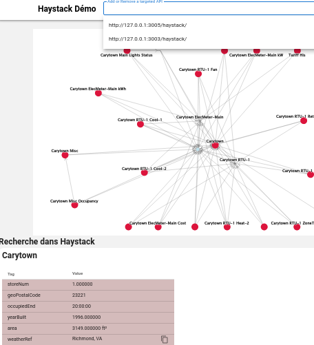
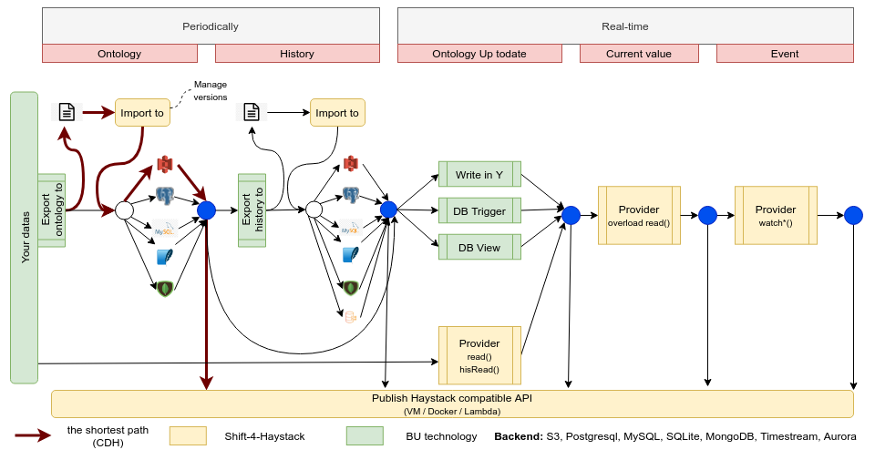

| The API is not stable and can be changed without any notice. |
| ------------------------------------------------------------ |

<!--TOC-->

- [Quick link](#quick-link)
- [About Haystack, and who is it for](#about-haystack-and-who-is-it-for)
- [About this project](#about-this-project)
- [History](#history)
- [Client side: Haystack client python module](#client-side-haystack-client-python-module)
  - [Inspect the data with code](#inspect-the-data-with-code)
  - [Python API](#python-api)
  - [Data science](#data-science)
- [Features](#features)
- [Server Side: Haystack API Server](#server-side-haystack-api-server)
  - [API Server deployment](#api-server-deployment)
    - [Installing](#installing)
    - [Choosing and configuring your provider](#choosing-and-configuring-your-provider)
    - [Starting the server](#starting-the-server)
- [Using Haystack API with UI](#using-haystack-api-with-ui)
- [Using GraphQL API](#using-graphql-api)
- [Specification extension](#specification-extension)
- [Haystack filter](#haystack-filter)
- [Add Haystack API to an existing project](#add-haystack-api-to-an-existing-project)
- [Using AWS](#using-aws)
- [Docker](#docker)
- [Using with Excel or PowerBI](#using-with-excel-or-powerbi)
- [Optional part](#optional-part)
- [Data types](#data-types)
  - [`Null`, `Boolean`, `Date`, `Time`, `Date/Time` and `strings`.](#null-boolean-date-time-datetime-and-strings)
  - [`Numbers`](#numbers)
  - [`Marker` and `Remove`](#marker-and-remove)
  - [`Bin` and `XBin`](#bin-and-xbin)
  - [`Uri`](#uri)
  - [`Ref`](#ref)
  - [`Coordinate`](#coordinate)
  - [Collection `List`, `Dict` or `Grid`](#collection-list-dict-or-grid)
- [Contributing](#contributing)
- [Resources](#resources)
- [License](#license)
- [TODO](#todo)

<!--TOC-->

Shift-for-Haystack is a set of API to implement the [Haystack project specification](https://project-haystack.org/).
It's compatible with modern Python with typing, Flask server in data center, Edge (Raspberry?) or in AWS Lambda
function.

Click to see a demo.

[](http://www.youtube.com/watch?v=5DBcHUlwv4g "Shift-4-Haystack demo")

# Quick link

- [Try-it online](#inspect-the-data-with-code)?
- Using [AWS Lambda](#using-aws)?
- [HTTP API Provider](#choosing-and-configuring-your-provider)?

# About Haystack, and who is it for

[Haystack project](https://project-haystack.org/) is an open source initiative to standardize semantic data models for
Internet Of Things. It enables interoperability between any IoT data producer and consumer, mainly in the Smart Building
area.

Haystack core data model is the Grid, it can be serialized in many formats,
mainly [Zinc](https://www.project-haystack.org/doc/docHaystack/Zinc),
[Trio](https://www.project-haystack.org/doc/docHaystack/Trio)
[Json](https://www.project-haystack.org/doc/docHaystack/Json)
and [Csv](https://www.project-haystack.org/doc/docHaystack/Csv)

# About this project

This project implements client side haystack code. Useful to parse or dump Haystack files
([Zinc](https://www.project-haystack.org/doc/docHaystack/Zinc),
[Json](https://www.project-haystack.org/doc/docHaystack/Json),
[Trio](https://www.project-haystack.org/doc/docHaystack/Trio)
and [Csv](https://www.project-haystack.org/doc/docHaystack/Csv)).

On the server side, it also implements [Haystack HTTP API](https://project-haystack.org/doc/docHaystack/HttpApi), useful
to serve Haystack data you host.

- We implemented different serving options See [API Server](#server-side-haystack-api-server)
    - Each offering two API endpoints:
      - Classical Haystack HTTP API
      - GraphQL API
- We introduced and implemented the *Provider* concept, which handles various options in terms on haystack data
  location:
    - Local or remote file system (including AWS S3)
    - Local or remote relational database
    - Local or remote Mongo database
    - Can be extends with optional AWS Time Stream use for Time Series
    - Other custom data location can be handled by extending `shaystack.providers.HaystackInterface`

# History

This project is a fork of [hszinc](https://github.com/widesky/hszinc)
(Thanks to the team). The proposed evolutions were too big to be accepted in a pull request.

To see the similarities and differences between the two project, click [here](hszinc.md)

# Client side: Haystack client python module

To try the client side python module included in this project, the best way is to download a sample of haystack files.
First, create a working directory.

```console
$ mkdir $TMP/haystack
$ cd $TMP/haystack
```

Download and
unzip [sample zip file](https://downgit.github.io/#/home?url=https://github.com/engie-group/shaystack/tree/develop/sample)
in this directory.

```console
$ unzip sample
```

The directory `sample` now contains:

- `carytown.[csv|jon|zinc|trio]`: A public reference haystack ontology
- `p:demo:*.zinc`: A sample of time series data (`ts`,`val` zinc format)

Create a virtual environment

```console
$ virtualenv -p python3.8 venv
$ source venv/bin/activate
```

Then, install the module with all options

```console
$ pip install "shaystack[flask,graphql,lambda]"
```

## Inspect the data with code

[`haystack.ipynb`](https://github.com/engie-group/shaystack/blob/develop/haystack.ipynb) jupyter notebook contains code
to read, filter, manipulate and print `Grid` objects containing haystack data.

Try it online [here](https://colab.research.google.com/github/pprados/shaystack/blob/develop/haystack.ipynb), test
the [User interface](https://shaystack.digital.engie.com/haystack/?iss=https%3A%2F%2Fengie.okta-emea.com) #(https://skz7riv2yk.execute-api.us-east-2.amazonaws.com/dev/)
or run it with [docker](#docker)

## Python API

The [documentation of the API is here](https://engie-group.github.io/shaystack/api/shaystack/index.html).

## Data science

It's easy to convert a grid to a dataframe.

```python
import shaystack
import panda

with open("file.zinc") as f:
    grid = shaystack.parse(f.read(), shaystack.MODE_ZINC)

df = panda.DataFrame(grid.filter("point and co2e"))  # Convert grid to data frame
```

# Features

Shift-4-Haystack is agile and can be deployed in different scenarios. Choose an option for each feature.

| Haystack backend                  |        Python version         | Deployment              |Multi tenancy             | API                                               |
| --------------------------------- |:-----------------------------:| ----------------------- |------------------------- | ------------------------------------------------- |
| local file                        |              3.7              | Internet Flask server   |Single tenancy            | Haystack HTTP API                                 |
| url                               |              3.8              | Edge Flask server       |Multiple, shared table    | Standalone GraphQL API                            |
| S3 bucket without version         |              3.9              | Docker Flask server     |Multiple, dedicated table | GraphQL API integrated inside another via AppSync |
| S3 bucket with version            |                               | Internet AWS Lambda API |||
| Sqlite database                   | Not available in this release |||
| Postgres database                 ||||
| MySQL database                    ||||
| Mongo database                    ||||
| haystack backend + AWS Timestream ||||

| Serverless  | Technologies                             |
| ----------- | ---------------------------------------- |
| No          | VM, Docker, Postgres, MySQL, Mongo, etc. |
| Yes         | AWS Lambda, Aurora                       |


and you can extend these proposed scenario. You can see below, how to install these different scenarios.

# Server Side: Haystack API Server

This implementation can offer two API endpoints:

- Classical [Haystack HTTP API](https://project-haystack.org/doc/docHaystack/HttpApi)
  - Available on `http://<host>:<port>/haystack`
- GraphQL
  - Available on `http://<host>:<port>/graphql` and compliant
    with [`schema.graphql`](https://github.com/engie-group/shaystack/blob/develop/schema.graphql)

This API can negotiate:

- Request format (`Content-Type: text/zinc`, `text/trio`, `application/json` or `text/csv`)
- Response format (`Accept: text/zinc, text/trio, application/json, text/csv`)

These [operations](https://project-haystack.org/doc/docHaystack/Ops) are implemented in both endpoints:

- [about](https://project-haystack.org/doc/docHaystack/Ops#about)
- [ops](https://project-haystack.org/doc/docHaystack/Ops#ops)
- [formats](https://project-haystack.org/doc/docHaystack/Ops#formats)
- [read](https://project-haystack.org/doc/docHaystack/Ops#read)
- [hisRead](https://project-haystack.org/doc/docHaystack/Ops#hisRead)
- [nav](https://project-haystack.org/doc/docHaystack/Ops#nav)
- [invokeAction](https://project-haystack.org/doc/docHaystack/Ops#invokeAction)

These [operations](https://project-haystack.org/doc/docHaystack/Ops) are implemented only in a classical endpoint, with
real-time datas:

- [watchSub](https://project-haystack.org/doc/docHaystack/Ops#watchSub)
- [watchUnsub](https://project-haystack.org/doc/docHaystack/Ops#watchUnsub)
- [watchPoll](https://project-haystack.org/doc/docHaystack/Ops#watchPoll)
- [pointWrite](https://project-haystack.org/doc/docHaystack/Ops#pointWrite)
- [hisWrite](https://project-haystack.org/doc/docHaystack/Ops#hisWrite)

## API Server deployment

This layer implement the standard HaystackAPI with different providers (URL, S3, Postgres, MySQL, MongoDB, etc.)

### Installing

Using `pip install shaystack`. You can add the support of some options for server side:

- `pip install "shaystack[flask]"` allows you to use a local [Flask](https://flask.palletsprojects.com/en/1.1.x/)
  server
- `pip install "shaystack[lambda]"` allows you to:
    - Serve the API in an AWS Lambda function
    - Expose haystack data located in an AWS S3 Bucket
- `pip install "shaystack[flask,graphql]"` allows you to:
    - Expose the `/graphql` endpoint in addition to the classical `/haystack` endpoint

You can mix two or more options, if you need them all, use `pip install "shaystack[flask,graphql,lambda]"`

### Choosing and configuring your provider

Depending on where and how your haystack data is stored, you need to choose an existing Provider or implement your own
by extending `shaystack.providers.HaystackInterface`

|Where is data stored|Shell command|Miscellaneous|
|---|---|---|
|No data, just testing|`HAYSTACK_PROVIDER=shaystack.providers.ping \`<br/>` shaystack`||
|Data on http server|`HAYSTACK_PROVIDER=shaystack.providers.db \`<br/>` HAYSTACK_DB=http://... \`<br/>` shaystack`|[More...](url_provider.md)|
|Data on ftp server|`HAYSTACK_PROVIDER=shaystack.providers.db \`<br/>` HAYSTACK_DB=ftp://... \`<br/>` shaystack`|[More...](url_provider.md)|
|Data on local filesystem|`HAYSTACK_PROVIDER=shaystack.providers.db \`<br/>` HAYSTACK_DB=file://... \`<br/>` shaystack`|[More...](url_provider.md)|
|Data on AWS S3 Bucket|`HAYSTACK_PROVIDER=shaystack.providers.db \`<br/>` HAYSTACK_DB=s3://... \`<br/>` shaystack`|Remember to install aws support and boto3 python module. [More...](url_provider.md)|
|Data in a SuperSQLite database|`HAYSTACK_PROVIDER=shaystack.providers.db \`<br/>` HAYSTACK_DB=sqlite3://... \`<br/>` shaystack`|Remember to install Supersqlite python module. [More...](sql_provider.md)|
|Data in a Postgresql database|`HAYSTACK_PROVIDER=shaystack.providers.db \`<br/>` HAYSTACK_DB=postgres://... \`<br/>` shaystack`|Remember to install psycopg2 python module. [More...](sql_provider.md)|
|Data in a MySQL database|`HAYSTACK_PROVIDER=shaystack.providers.db \`<br/>` HAYSTACK_DB=mysql://... \`<br/>` shaystack`|Remember to install pymysql python module. [More...](sql_provider.md)|
|Data in a MongoDB|`HAYSTACK_PROVIDER=shaystack.providers.db\`<br/>`HAYSTACK_DB=mongodb+srv:://...\`<br/>` shaystack`|Remember to install pymongo python module. [More...](mongo_provider.md)|
|Data in a database and Time series in AWS Time Stream|`HAYSTACK_PROVIDER=shaystack.providers.timestream\`<br/>`HAYSTACK_DB=...\`<br/>`HAYSTACK_TS=timestream:://...\<br /> shaystack`|[More...](timestream_provider.md)|
|Data in a database and Time series in AWS Athena|`HAYSTACK_PROVIDER=shaystack.providers.athena\`<br/>`HAYSTACK_DB=...\`<br/>`HAYSTACK_TS=athena:://...\<br /> shaystack`|[More...](athena_provider.md)|
|Custom|`HAYSTACK_PROVIDER=shaystack.providers.<your module name>\`<br/>` shaystack`|Write your own subclass of `shaystack.providers.HaystackInterface|

*Note: Existing providers are not connected to IOT for simplicity. If you want to connect the haystack API with IOT, you
must implement a custom provider or extend one of them.*

### Starting the server

Set some environment variables, and use the command `shaystack` (check `shaystack --help` for parameters)

We propose different providers, with the objective in mind:

- Expose the haystack files and historical data with an API
- manage the evolution of these files with the notion of `version`.

To demonstrate this scenario, we want to publish the sample from `sample/` files from S3 bucket or from an SQL database.
We must import this ontology and time-series inside the bucket or database before to use. To manage the different
versions of files, you must use a dedicated tool, to import only the difference between versions.

# Using Haystack API with UI

Now, it's time to manipulate the ontology.

For the demonstration,

```console
$ # Demo
$ # - Install components
$ pip install 'shaystack[graphql]'
$ # - Expose haystack file on s3 bucket, with Haystack and GraphQL API
$ HAYSTACK_PROVIDER=shaystack.providers.db \
  HAYSTACK_DB=https://shaystack.s3.eu-west-3.amazonaws.com/carytown.zinc \
  shaystack
```

In another shell

```console
$ curl "http://localhost:3000/haystack/read?filter=point%20or%20site&limit=5"
```

or

```console
$ # - Open the GraphQL console
$ xdg-open http://localhost:3000/haystack
```

A javascript console is proposed to ask the datas. It's possible to add several APIs to merge the result from different
sources of data.



For example, one datasource comes from an ETL to expose the ontology of the inventory and energy bills from the
accounting department in a S3 bucket. The second datasource is the BMS (Building Management System)
compatible with Haystack, with the real-time data. If the entities use the same `id`, all the information were merged.
The same filter was apply for each API.

# Using GraphQL API

All the providers can be invoked with a GraphQL API in place of the standard Haystack HTTP API. After installing the
component with the good option (`pip install 'shaystack[graphql]'`), start the provider and use the url
`http://localhost:3000/graphql`. You can see an interface to use the ontology.

For the demonstration,

```console
$ # Demo
$ # - Install components
$ pip install 'shaystack[graphql]'
$ # - Expose haystack with GraphQL API
$ HAYSTACK_PROVIDER=shaystack.providers.db \
  HAYSTACK_DB=https://shaystack.s3.eu-west-3.amazonaws.com/carytown.zinc \
  shaystack
```

In another shell

```console
$ # - Open the GraphQL console
$ xdg-open http://localhost:3000/graphql
```

and use this request

```
# Demo
{
    haystack {
        versions
        about
        {
            haystackVersion
            tz
            serverName
            serverTime
            serverBootTime
            productName
            productUri
            productVersion
            moduleName
            moduleVersion
        }
        ops
        {
            name
            summary
        }
        byid:entities(ids:["@p:demo:r:23a44701-3a62fd7a"])
        byfilter:entities(select: "id,dis" filter: "id", limit: 2)
        histories(ids:["@p:demo:r:23a44701-3a62fd7a"])
        {
            ts
            float
        }
        country:tagValues(tag:"geoCountry")
    }
}
```

Because Graphql use a schema and Haystack doesn't use one, it's not easy to manipulate the history result. To resolve
that, we propose different *cast* for the values.

```
histories(ids:["@p:demo:r:23a44701-3a62fd7a"])
{
ts
val  # Haystack json scalar
float # cast to float
bool # cast to bool
...
}
```

You can select the format you want in the request.

# Specification extension

To manage the history of ontologies, it's possible to add a parameter almost all request: `Version`
This parameter must have the datetime when you want to ask the ontology. The result is the *vue*
of these data at this time.

To return only some tag, it's possible to add a parameter `select` in `read` request.

```python
grid.select("id,dis")
grid.select("!hisURL")
```

The syntax to analyse the date range in `hisRead` is extended to accept a comma without value before or after (`date,`
, `,datetime`, etc.) and usage of `today` and `yesterday` in left or right.

# Haystack filter

A big part of the code is to convert the haystack *filter* to a database request. We implemented a conversion to
different languages:

- python
- SQLite
- PostgreSQL
- MySql
- Mongodb

For the developer point of view, it may be interesting to analyse the translation. We propose a tool for that.

```console
$ shaystack_repl
(Cmd) ?

Documented commands (type help <topic>):
========================================
help

Undocumented commands:
======================
bye  mongo  mysql  pg  python  sqlite

(Cmd) 
```

Enter the language followed by the haystack filter.

```console
(Cmd) python site or point
def _gen_hsfilter_0(_grid, _entity):
  return ((id(_get_path(_grid, _entity, ['site'])) !=  id(NOT_FOUND)) or (id(_get_path(_grid, _entity, ['point'])) !=  id(NOT_FOUND)))

(Cmd) pg site or point
-- site or point
SELECT t1.entity
FROM haystack as t1
WHERE
'2020-10-01T00:00:00+00:00' BETWEEN t1.start_datetime AND t1.end_datetime
AND t1.customer_id='customer'
AND t1.entity ?| array['site', 'point']
LIMIT 1
```

# Add Haystack API to an existing project

The flexibility of shift-4-haystack allows many integration scenarios.

To expose your current datas with a haystack protocol, the steps are:

- associate your fields to a collections of haystack tags
- group your tags in entities
- add a uniq `id' for each entity
- add reference between entities

Then, with this model, choice a path to expose your haystack data.



Add features from left to right. At different levels, you can publish an API. The shortest way is to export a haystack
file to a s3 bucket and publish it via an API. You can exporte the data in a file, or directly in another table of you
database. Later, you link your data model with the haystack model with a double write (write in Y), some trigger in your
data model to maintain the consistency between tables or create a view from your data model to be compatible with the
haystack json model. Or, you can create your provider to read and convert your datas to haystack format.

Later, you can add a connection with your IOT to expose the current value of points, and add the
`watch` features.

To implement a provider, two strategies are proposed:

- Read the entire ontology in memory, apply the `filter()` and return the result
- Convert the filter request to a specific request on your data model, convert the row to entities and return the
  result.

# Using AWS

To use Lambda or S3 bucket, read [more...](AWS.md)

# Docker

The `Dockerfile` can be used to generate an image with a set of parameter.

Use a pre-builded image.

```console
$ docker run -it -p 3000:3000 \
  -e HAYSTACK_PROVIDER=shaystack.providers.db \
  -e HAYSTACK_DB=https://shaystack.s3.eu-west-3.amazonaws.com/carytown.zinc \
  -e REFRESH=15 \
  pprados/shaystack 
```

or build your image

```console
$ # Get docker file
$ wget https://github.com/engie-group/shaystack/blob/develop/docker/Dockerfile
$ # Build the image
$ docker build \
		--build-arg PORT='3000' \
		--build-arg HAYSTACK_PROVIDER='shaystack.providers.db' \
		--build-arg HAYSTACK_DB='https://shaystack.s3.eu-west-3.amazonaws.com/carytown.zinc' \
		--build-arg HAYSTACK_TS='' \
		--build-arg REFRESH='15' \
		--tag 'shaystack' \
		.
$ # Run the image
$ docker run -it -p 3000:3000 shaystack 
```

# Using with Excel or PowerBI

Because the default negotiated format is CSV, you can call the HTTP API with PowerQuery or Excel. Try the sample file
['SHaystack.xlsm'](https://raw.githubusercontent.com/engie-group/shaystack/develop/SHaystack.xlsm) and set a correct
haystack API url
(http://10.0.2.2:3000/haystack with a local virtual windows). You can load all and filter the data inside Excel table.

# Optional part

Haystack component propose different optional parts.

| Option  | Feature                                         |
| ------- | ----------------------------------------------- |
| flask   | Expose API with Flask HTTP server               |
| graphql | Expose Graphql API with Flask HTTP server       |
| lambda  | Add compatibility with AWS Lambda and S3 bucket |

Use `pip install "shaystack[_<options>_]"`, like:

- `pip install "shaystack[flask,graphql,lambda]"`

# Data types

Shift-4-haystack converts the common Python data types:

## `Null`, `Boolean`, `Date`, `Time`, `Date/Time` and `strings`.

In the case of Date/Time, the `tzinfo` parameter is set to the equivalent timezone provided by the `pytz` library where
possible.

## `Numbers`

Numbers without a unit are represented as `float` objects. Numbers with a unit are represented by
the `shaystack.Quantity` custom type which has two attributes: `value` and `unit`. The unit use
the [Pint](https://pint.readthedocs.io/en/stable/) framework to manage and convert unit.

## `Marker` and `Remove`

These are singletons, represented by `shaystack.MARKER` and `shaystack.REMOVE`. They behave and are intended to be used
like the `None` object.

## `Bin` and `XBin`

These are represented bytes array. Accept `hex` or `b64` to encode and decode the bytes array.

## `Uri`

This is a classical `Uri` for Haystack

## `Ref`

Represented by the custom type `shaystack.Ref` which has `name` (`str`)
and `value` attributes. The `name` must be conforme with the haystack specification.

## `Coordinate`

Represented by the custom type `shaystack.Coordinate`, which has `latitude` and
`longitude` types (both `float`)

## Collection `List`, `Dict` or `Grid`

A tag may be a list, a dict or another grid (recursive grid). To be used with care.

# Contributing

See [here](https://github.com/engie-group/shaystack/blob/develop/docs/contributing.md)

# Resources

- [Haystack Project](https://www.project-haystack.org/)
- [Zappa](https://github.com/Miserlou/Zappa) framework

# License

See [LICENCE](https://github.com/engie-group/shaystack/blob/develop/LICENSE) file

# TODO

- [X] S3
- [X] SQLite
- [X] Postgres
- [X] MySQL
- [X] MongoDB
- [ ] Implements *watch* in GraphQL
- [ ] Implements *write* in GraphQL
- [ ] An alternative with FastAPI
- [ ] Compatible with Pypy (when pip install typed-ast running)
- [ ] Docker images with ARM
